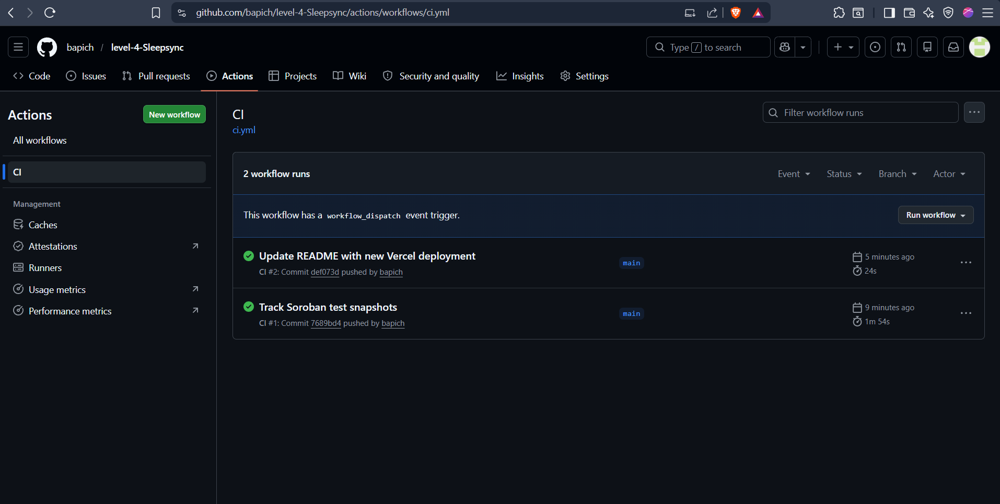

# SleepSync

[](https://github.com/bapich/SleepSync-level-4/actions/workflows/ci.yml)

SleepSync is a Stellar Soroban sleep-discipline dApp that turns weekly rest goals into verifiable on-chain activity. A user connects a Freighter wallet, creates a public sleep profile, sets a weekly sleep-minute goal, logs sleep sessions, builds an on-time bedtime streak, and reviews dashboard metrics powered by the deployed Soroban contract.

- Live demo: https://sleepsync-one.vercel.app
- Public repository: https://github.com/bapich/SleepSync-level-4
- MVP video: https://drive.google.com/file/d/18eCFxW8KkVGKhuTWgdlSQWu2hJvEFe0-/view?usp=sharing
- Network: Stellar Testnet
- Wallet: Freighter
- Frontend: Vite, React, Stellar SDK
- Smart contract: Rust, Soroban SDK

## Overview

SleepSync focuses on consistency rather than passive tracking. The contract stores each wallet's sleep profile, weekly goal, total sessions, current week progress, consistency score, recovery score, and bedtime streak. The frontend exposes those actions through a responsive dashboard with wallet signing, sleep-session logging, progress cards, and a public Soroban event feed.

Core user flow:

1. Connect a Freighter wallet on Stellar Testnet.
2. Create or update a SleepSync profile with a display name and weekly goal.
3. Log a sleep session with type, duration, and on-time bedtime status.
4. Track weekly minutes, streak, consistency score, recovery score, and total sessions.
5. Inspect recent contract events and explorer links from the public feed.

## Staging

The screenshots below are shown in the same sequence used for submission review.

### 1. Deployed Dashboard


### 2. Mobile Responsive View


### 3. CI/CD Pipeline



GitHub Actions badge:

[](https://github.com/bapich/SleepSync-level-4/actions/workflows/ci.yml)

## Project Requirements

- Public GitHub repository: complete
- README documentation: complete
- Minimum 8+ meaningful commits: complete
- Live demo deployed on Vercel: complete
- Mobile responsive screenshot: included above
- CI/CD screenshot and badge: included above
- Contract addresses and transaction hashes: included below
- Inter-contract calls: not used
- Custom token or pool deployment: not used
- MVP video link: included above

## Deployment Details

Frontend deployment:

- Provider: Vercel
- Project name: `sleepsync`
- Live URL: https://sleepsync-one.vercel.app
- Build command: `npm run build:web`
- Output directory: `frontend/dist`

Contract deployment:

- Contract name: `SleepSync`
- Contract alias: `sleep_sync`
- Network: Stellar Testnet
- Source account alias: `alice`
- Deployed at: `2026-04-25T08:39:17.430Z`
- Contract ID: `CCD376AONWVQF2EPK6BMLS3PDBMIWVWHV4DIAZVIDJZEUOK6HPYAE2EH`
- Contract explorer: https://lab.stellar.org/r/testnet/contract/CCD376AONWVQF2EPK6BMLS3PDBMIWVWHV4DIAZVIDJZEUOK6HPYAE2EH
- WASM upload transaction hash: `6c67f75c68a02a5d90c0e1d9c78ebcdfcc7d817568b5a89b9a82c1ad64c00b76`
- Contract deploy transaction hash: `42a7bd0f7ef1c1eaae3e64f03200e5c5ee0af8fe0133d6ade8d4d1f0716edc5d`
- Inter-contract calls: none
- Custom token address: not applicable
- Pool address: not applicable

The deployment record is stored in [`deployments/testnet.json`](./deployments/testnet.json). The frontend fallback contract config is generated into [`frontend/src/lib/contract-config.js`](./frontend/src/lib/contract-config.js).

## Contract Interface

Public methods:

- `save_profile(sleeper, display_name, weekly_goal_minutes)`: creates or updates a wallet sleep profile.
- `update_weekly_goal(sleeper, new_goal_minutes)`: updates the profile's weekly sleep target.
- `log_session(sleeper, sleep_type, minutes_slept, slept_on_time)`: records a sleep session and updates dashboard metrics.
- `has_profile(sleeper)`: checks whether a wallet already has a profile.
- `get_dashboard(sleeper)`: returns profile, progress, streak, consistency, and recovery data.
- `get_session_count(sleeper)`: returns the number of logged sessions for a wallet.
- `get_session(sleeper, index)`: returns one stored sleep-session record.

Events:

- `profile_saved`
- `weekly_goal_updated`
- `sleep_logged`
- `weekly_goal_reached`

Validation rules:

- Display names must be 3-32 characters.
- Sleep session labels must be 3-48 characters.
- Sleep session duration must be 5-480 minutes.
- Weekly sleep goals must be 30-5000 minutes.

## Repository Structure

```text
SleepSync-level-4/
|-- contracts/sleep_sync/        # Rust Soroban smart contract
|-- frontend/                    # Vite React dApp
|-- scripts/                     # Deployment and config export scripts
|-- deployments/testnet.json     # Current Stellar Testnet deployment
|-- assets/                      # Submission screenshots and badges
|-- .github/workflows/ci.yml     # GitHub Actions pipeline
`-- vercel.json                  # Vercel frontend routing/build config
```

## Local Development

Install dependencies:

```bash
npm install
```

Run the frontend:

```bash
npm run dev
```

Run contract tests:

```bash
npm run contract:test
```

Build the contract WASM:

```bash
npm run contract:wasm
```

Export the deployed contract config for the frontend:

```bash
npm run export:frontend
```

Build the frontend:

```bash
npm run build:web
```

Run the full verification path:

```bash
npm run verify
```

## Deployment Workflow

Create and fund a Stellar Testnet identity:

```bash
stellar keys generate alice --network testnet --fund
```

Configure environment variables:

```bash
STELLAR_ACCOUNT=alice
STELLAR_NETWORK=testnet
STELLAR_CONTRACT_ALIAS=sleep_sync
VITE_STELLAR_RPC_URL=https://soroban-testnet.stellar.org
VITE_STELLAR_NETWORK_PASSPHRASE="Test SDF Network ; September 2015"
VITE_CONTRACT_ID=
```

Build and deploy the contract, then export frontend config:

```bash
npm run contract:build
npm run contract:deploy
npm run export:frontend
npm run build:web
```

## Verification

Expected checks before submission:

```bash
npm run contract:test
npm run lint
npm run build:web
```

The CI pipeline runs contract tests, builds the Soroban WASM artifact, installs frontend dependencies, generates the frontend contract config, builds the Vite app, and uploads the frontend bundle artifact.

## Troubleshooting

- If Freighter is not detected, open the app in a Chromium-based browser with the Freighter extension enabled.
- If the dashboard stays empty after connecting, confirm Freighter is using Stellar Testnet.
- If contract reads fail, rerun `npm run export:frontend` after updating `deployments/testnet.json` or `VITE_CONTRACT_ID`.
